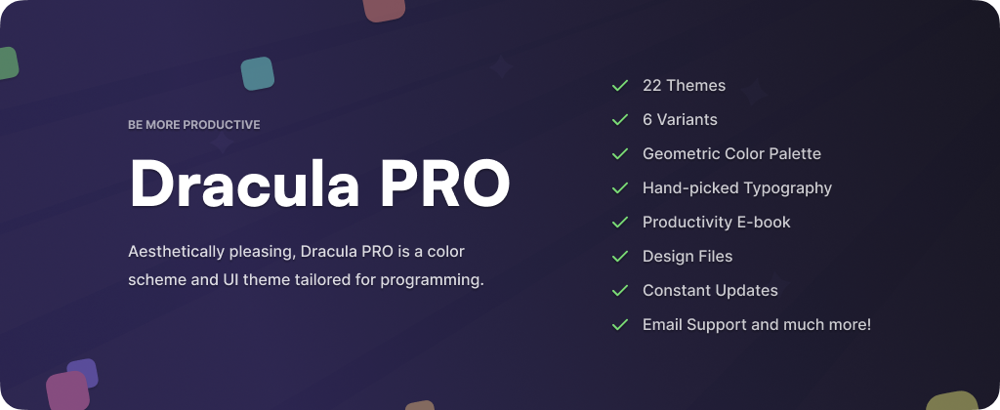

# Dracula Theme

> The most famous theme ever created, available for [Visual Studio Code](https://draculatheme.com/visual-studio-code), [iTerm](https://draculatheme.com/iterm), [Vim](https://draculatheme.com/vim), [Sublime Text](https://draculatheme.com/sublime), [JetBrains](https://draculatheme.com/jetbrains), [Terminal.app](https://draculatheme.com/terminal-app), [Windows Terminal](https://draculatheme.com/windows-terminal), [Hyper](https://draculatheme.com/hyper), [Alfred](https://draculatheme.com/alfred), [Slack](https://draculatheme.com/slack), [Xcode](https://draculatheme.com/xcode), [Emacs](https://draculatheme.com/emacs), [Zsh](https://draculatheme.com/zsh), and [400+ more applications](https://draculatheme.com).

## Install

Find installation instructions for your application at [draculatheme.com](https://draculatheme.com). Search for your app or browse the [full list of themes](https://draculatheme.com).

## Color Palette (OSS)

### Dracula

| Palette      | Hex       | RGB           | HSL             |            |
| ------------ | --------- | ------------- | --------------- | ------------------------------------------------------------------------------------------- |
| Background   | `#282a36` | `40 42 54`    | `231° 15% 18%`  |      |
| Current Line | `#44475a` | `68 71 90`    | `232° 14% 31%`  |  |
| Selection    | `#44475a` | `68 71 90`    | `232° 14% 31%`  |        |
| Foreground   | `#f8f8f2` | `248 248 242` | `60° 30% 96%`   |      |
| Comment      | `#6272a4` | `98 114 164`  | `225° 27% 51%`  |            |
| Cyan         | `#8be9fd` | `139 233 253` | `191° 97% 77%`  |                  |
| Green        | `#50fa7b` | `80 250 123`  | `135° 94% 65%`  |                |
| Orange       | `#ffb86c` | `255 184 108` | `31° 100% 71%`  |              |
| Pink         | `#ff79c6` | `255 121 198` | `326° 100% 74%` |                  |
| Purple       | `#bd93f9` | `189 147 249` | `265° 89% 78%`  |              |
| Red          | `#ff5555` | `255 85 85`   | `0° 100% 67%`   |                    |
| Yellow       | `#f1fa8c` | `241 250 140` | `65° 92% 76%`   |              |

### Alucard

| Palette      | Hex       | RGB           | HSL            |            |
| ------------ | --------- | ------------- | -------------- | ------------------------------------------------------------------------------------------- |
| Background   | `#fffbeb` | `255 251 235` | `48° 100% 96%` |      |
| Current Line | `#6c664b` | `108 102 75`  | `49° 18% 36%`  |  |
| Selection    | `#cfcfde` | `207 207 222` | `240° 18% 84%` |        |
| Foreground   | `#1f1f1f` | `31 31 31`    | `0° 0% 12%`    |      |
| Comment      | `#6c664b` | `108 102 75`  | `49° 18% 36%`  |            |
| Cyan         | `#036a96` | `3 106 150`   | `198° 96% 30%` |                  |
| Green        | `#14710a` | `20 113 10`   | `114° 84% 24%` |                |
| Orange       | `#a34d14` | `163 77 20`   | `24° 78% 36%`  |              |
| Pink         | `#a3144d` | `163 20 77`   | `336° 78% 36%` |                  |
| Purple       | `#644ac9` | `100 74 201`  | `252° 54% 54%` |              |
| Red          | `#cb3a2a` | `203 58 42`   | `6° 66% 48%`   |                    |
| Yellow       | `#846e15` | `132 110 21`  | `48° 73% 30%`  |              |

For more details about how to apply these different colors to represent different code symbols, please see the [Dracula Specification](https://draculatheme.com/spec).

## Contribute

Dracula Theme is an open-source project driven by and for the community. Most of the 400+ supported applications are community contributions.

We want to support all available applications, but we don't have the capacity to do it all ourselves. That's why your contributions are essential.

### How to submit a new theme

1. **Create a repository** using this [template](https://github.com/dracula/template).

   - Clone it or click "Use this template" on GitHub.

2. **Build your theme** using the [Color Palette](#color-palette) above.

   - Follow the template structure and add your theme files.

3. **Submit an issue** with a link to your repository.
   - Once accepted, we'll move it to the Dracula organization and give you maintainer access.

For detailed guidelines and specifications, visit our [Contribute page](https://draculatheme.com/contribute).

## FAQ

**"Are you going to support editor X?"**

We'd love to! Since you're already using that editor, you're probably more familiar with it than we are. Give it a try and [submit your theme](https://draculatheme.com/contribute)!

## Accessibility 

The colors maintain a `4.5:1` contrast ratio, complying with [WCAG 2.1 | Level AA](https://www.w3.org/TR/WCAG21/#contrast-minimum).

## Team

Dracula was created by [Zeno Rocha](https://github.com/zenorocha/) and is maintained with the help of many contributors. [Lucas de França](https://github.com/luxonauta) joined as co-maintainer in April 2022. Each theme has its maintainer listed in its repository's README.

|  |  |
| ---------------------------------------------------------------------------------------- | --------------------------------------------------------------------------------------------- |
| [Zeno Rocha](https://github.com/zenorocha)                                               | [Lucas de França](https://github.com/luxonauta)                                               |

## Organization

As Dracula grew to support 400+ applications, we moved from a single repository to a GitHub organization. Each theme now has its own repository, which makes it easier to:

- Support different package managers
- List maintainers for each theme
- Find installation instructions
- Release updates independently

Browse all themes in the [Dracula organization](https://github.com/dracula).

## Community

- [Contribute](https://draculatheme.com/contribute) - Learn how to create and submit themes
- [Twitter](https://twitter.com/draculatheme) - Get updates and announcements
- [GitHub Discussions](https://github.com/dracula/dracula-theme/discussions) - Ask questions and discuss
- [Discord](https://draculatheme.com/discord-invite) - Chat with the community

## Dracula PRO

Dracula PRO is a premium color scheme and UI theme designed for programming. It includes additional variants and features for terminal emulators, code editors, and syntax highlighters.

## Credits

Special thanks to the creators who inspired the beginning of Dracula:

- [@chenluois](http://mouapp.com/) for the color palette inspiration
- [@aziz](http://tmtheme-editor.herokuapp.com/) for the theme editor tools
- [@robbyrussell](https://github.com/robbyrussell) for the shell theme foundation

## Changelog

The changelog is available on the release page in each theme's repository.

## License

[MIT License](./LICENSE) © Dracula Theme
