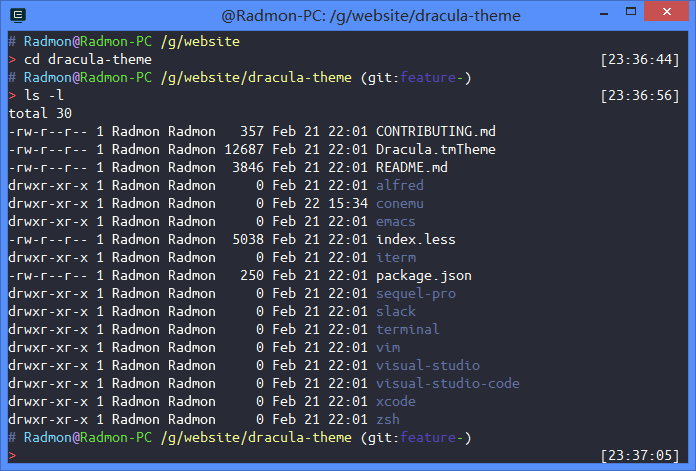

# Dracula Theme for ConEmu

## Screenshot


## Install

You have to manually modify ConEmu config file.

1. Open `ConEmu.xml` file. It is in the installation directory of ConEmu or the
user directory like `C:\Users\UserName`.

2. Find the palette definition. It is a xml tag starts with the following code:
    ```xml
    <key name="Palette1" modified="2016-02-21 19:15:02" build="160218">
      <value name="Name" type="string" data="ThemeName"/>
      <value name="ExtendColors" type="hex" data="00"/>
      ...
      <value name="ColorTable00" type="dword" data="00000000"/>
      <value name="ColorTable01" type="dword" data="00800000"/>
      ...
    ```

3. If you don't find the xml above, you may not have any custom color scheme.
So open ConEmu `Settings` dialog (Win+Alt+P), and go to `Features` -> `Colors`
-> `Schemes`, enter a name and click Save, then the palette definition will be
generated. Close ConEmu.

4. Replace the color table in the palette tag with the dracula color table
(see `conemu/dracula.xml`, there are 32 color values), save the `ConEmu.xml`.

5. Reopen ConEmu.

6. Notice that ConEmu's color scheme may not change in the later version, because
the `<Current color scheme>` is used by ConEmu instead of the `dracula`, you need
to go to `Features` -> `Colors` -> `Schemes` and switch to `dracula`.

## Build

I also provide a theme generating script. Please read `gen_theme.py` if you want
to make some modifications. It will be really easy to change colors in the palette,
and run `python gen_theme.py > themeName.xml` to generate a theme. And follow the
[install](#install) step for installation.
